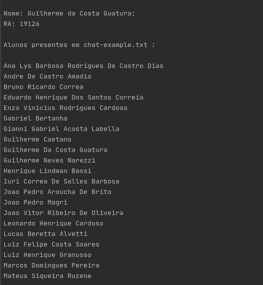

<p align="center">
    
</p>

# G. Meet Chat Crawler
this is a command-line application built to help you
know exactly who went to your meeting using the chat log .txt file.

## Usage
Clone the repository:

```bash
git clone https://github.com/guiguat/gmeet-chat-crawler.git
cd gmeet-chat-crawler
```

Then you can compile the "main.cpp" with your OS C++ 
compiler or as I show here, run the windows 64bit executable or the linux executable from the bin folder :
```bash
./bin/crawler ./chat-example.txt #linux
cmd /c \bin\crawler64.exe "chat-example.txt" #windows
```

## Preview
